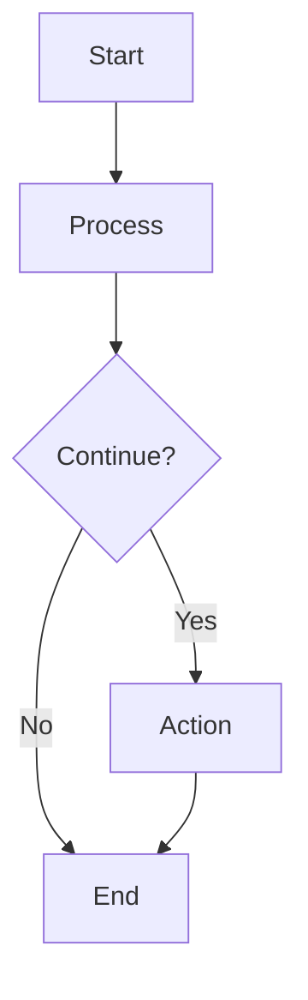
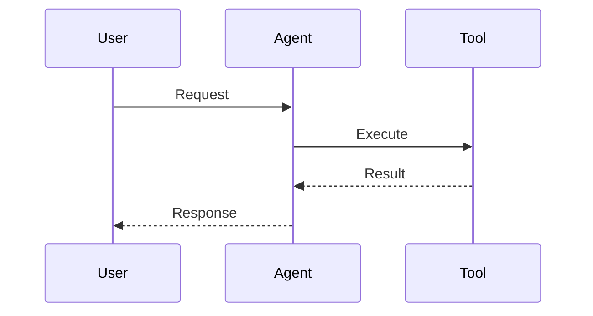
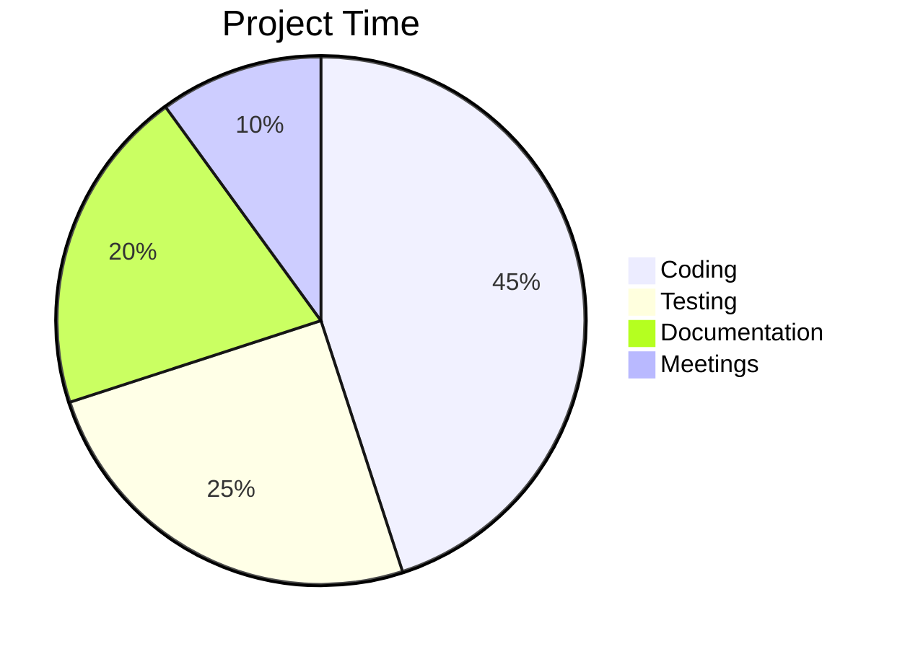
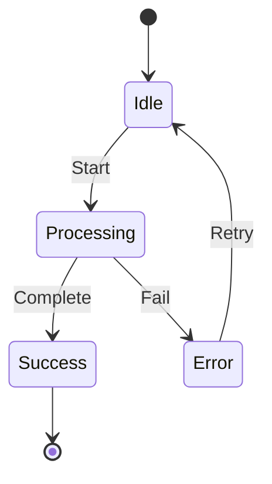
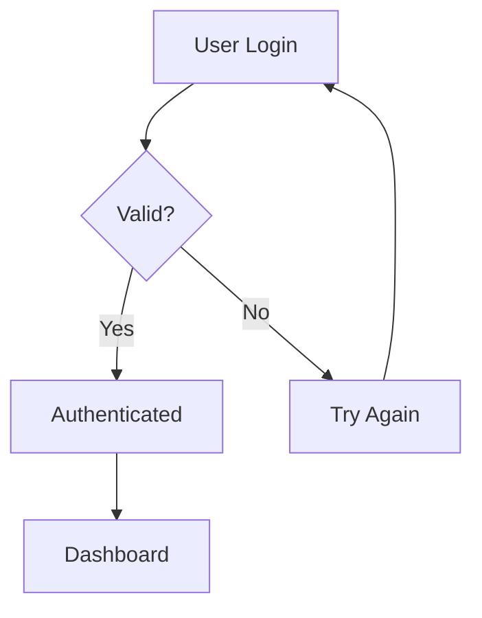

# Artifact Support Guide

Your MCP AI Agent now supports creating **Artifacts** - interactive HTML, SVG, and visualizations that render in Custom Web UI's artifact window!

## What Are Artifacts?

Artifacts are standalone, renderable content that Custom Web UI displays in a dedicated window alongside your chat. Instead of getting plain text responses, you get interactive web pages, graphics, and visualizations.

## What Can the Agent Create?

### 1. HTML News Pages
**Trigger words:** `news`, `show`, `display`

**Example requests:**
```
"Show me the latest AI news"
"Display the news"
"Get AI news and show it"
```

**What you get:**
- Beautiful, responsive HTML page
- Grid layout with article cards
- Clickable links to full articles
- Publication dates
- Modern gradient design

### 2. Data Visualizations
**Trigger words:** `create visualization`, `visualize`, `create chart`, `create graph`, `plot`

**Example requests:**
```
"Create a visualization"
"Visualize some data"
"Create a chart"
```

**What you get:**
- Interactive D3.js bar chart
- Hover effects
- Responsive design
- Sample data visualization

### 3. SVG Graphics
**Trigger words:** `create svg`, `generate svg`, `make an svg`

**Example requests:**
```
"Create an SVG graphic"
"Generate an SVG with text Hello World"
"Make an SVG image"
```

**What you get:**
- Scalable vector graphic
- Gradient background
- Custom text (if specified)
- 400x200px size

### 4. Custom HTML Pages
**Trigger words:** `create html`, `generate html`, `make a webpage`, `build a page`

**Example requests:**
```
"Create an HTML page"
"Generate HTML for..."
"Build a webpage"
```

## How to Use

### Basic News Artifact
```
You: Show me the latest AI news

Agent: [Fetches news and generates beautiful HTML page]
       Custom Web UI displays it in the artifact window →
```

### Visualization
```
You: Create a data visualization

Agent: [Generates interactive D3.js chart]
       See the interactive bar chart in artifacts →
```

### SVG Graphic
```
You: Create an SVG with text "Welcome"

Agent: [Generates SVG graphic with custom text]
       Scalable graphic appears in artifacts →
```

## Features

### News Artifacts Include:
- ✅ Up to 10 latest articles
- ✅ Clickable headlines
- ✅ Article summaries (200 chars)
- ✅ Publication dates
- ✅ Responsive grid layout
- ✅ Hover animations
- ✅ Purple gradient theme

### Visualizations Include:
- ✅ Interactive D3.js charts
- ✅ Hover effects on bars
- ✅ Axis labels
- ✅ Responsive design
- ✅ Clean, modern styling

### Text Formatting
Even when NOT creating artifacts, responses are now better formatted:

**Before:**
```
Here is some text about AI. It discusses multiple topics. First topic is models. Second topic is training. Third topic is deployment.
```

**After:**
```
Here is some text about AI.

It discusses multiple topics.

• First topic is models
• Second topic is training  
• Third topic is deployment
```

## How It Works

1. **Detection**: Agent detects keywords in your message
2. **Tool Execution**: Fetches data (news, time, etc.)
3. **Artifact Generation**: Creates HTML/SVG if appropriate
4. **Return**: Sends complete HTML to Custom Web UI
5. **Rendering**: Custom Web UI automatically displays it as an artifact

## Combining with Tools

Artifacts work seamlessly with tool execution:

```
You: Get the latest news and show it as a webpage

Agent: 
1. Executes news tool → fetches 10 articles
2. Detects "show" keyword → artifact mode
3. Generates HTML page with articles
4. Returns beautiful news page artifact
```

## Tips for Best Results

### For News Artifacts
- Use "show" or "display" to ensure artifact generation
- Agent fetches from TechCrunch, VentureBeat, etc.
- Articles are automatically formatted

### For Visualizations
- More visualization types coming soon!
- Currently provides sample data
- Interactive features included

### For Custom HTML
- Agent can generate custom pages
- Specify what you want in the page
- Full HTML/CSS/JS support

## Technical Details

### Supported Formats
- **HTML**: Complete webpages with CSS and JavaScript
- **SVG**: Scalable vector graphics
- **Mixed**: HTML pages with embedded SVG, D3.js, etc.

### Not Supported (Yet)
- React components (plain HTML/JS only)
- Markdown (rendered as text)
- Plain code snippets (rendered as text)

### File Location
Artifact generation code: `src/agent/artifacts.py`
Server integration: `src/agent/server.py`

## Examples in Action

### Example 1: News Dashboard
```
You: Show me AI news
→ Beautiful HTML page with 10 latest articles
→ Grid layout, clickable links, summaries
→ Purple gradient theme
```

### Example 2: Quick Viz
```
You: Create a chart
→ Interactive D3.js bar chart
→ Hover effects, labeled axes
→ Sample data visualization
```

### Example 3: Custom SVG
```
You: Make an SVG saying "Hello World"
→ Gradient SVG graphic
→ Custom text centered
→ 400x200px scalable image
```

## MermaidJS Diagrams (Built-in to Custom Web UI!)

Custom Web UI automatically renders **MermaidJS diagrams** when you generate them!

### What's MermaidJS?

MermaidJS creates beautiful diagrams from text-based syntax. Custom Web UI detects and renders them automatically in the chat.

### Supported Diagram Types

**Flowcharts:**
````markdown

````

**Sequence Diagrams:**
````markdown

````

**Pie Charts:**
````markdown

````

**State Diagrams:**
````markdown

````

### How to Use

**You ask:**
```
"Create a flowchart for user authentication"
```

**Agent responds with:**
````markdown

````

**You see:** Beautiful rendered flowchart in the chat!

### Critical Rules

**MUST start code block with `mermaid`:**
- ✅ Correct: ` ```mermaid `
- ❌ Wrong: ` ```mermaidjs ` or ` ```diagram `

**Common Use Cases:**
- Process flows: "Create flowchart for..."
- Workflows: "Visualize the workflow for..."
- Decisions: "Make a decision tree for..."
- Timelines: "Show a gantt chart of..."
- Architecture: "Diagram the system architecture"

## Python Code Execution (Bonus Feature!)

In addition to artifacts, Custom Web UI supports **Python code execution** using Pyodide!

### What's Python Code Execution?

When your agent generates Python code in a code block, Custom Web UI shows a **Run button** that executes the code directly in the browser using Pyodide (WebAssembly Python).

### Supported Libraries
- micropip, packaging
- requests, beautifulsoup4
- numpy, pandas
- matplotlib
- scikit-learn, scipy
- regex

### How It Works

**You ask:**
```
"Write Python code to analyze this data with pandas"
```

**Agent responds with:**
````python
import pandas as pd

data = {'Name': ['John', 'Anna', 'Peter'], 
        'Age': [28, 24, 35]}
df = pd.DataFrame(data)
print(df)
````

**You see:** Run button appears → Click it → Code executes → Results show below code block!

### Artifacts vs Python Code

**Artifacts (What We Built):**
- HTML/SVG pages that render in artifact window
- Use for: News pages, charts, graphics
- Trigger: "show", "display", "create"
- Result: Beautiful rendered page

**Python Code Execution (Built-in to Custom Web UI):**
- Python code with Run button
- Use for: Data analysis, calculations, ML
- Trigger: "write python code", "analyze with pandas"
- Result: Executable code block

### Combined Power

You can use BOTH features together!

**Example 1: Fetch data, then analyze**
```
You: Get AI news and write Python to analyze the headlines

Agent: 
1. Fetches news (tool execution)
2. Returns Python code to analyze
3. You click Run → see analysis
```

**Example 2: Show results beautifully**
```
You: Analyze this data and show results as HTML

Agent:
1. Writes Python for analysis
2. Generates HTML artifact with results
3. You see both: code + beautiful chart
```

### Tips for Python Code

1. **Mention Pyodide**: "Write Python code for Pyodide environment"
2. **Use supported libraries**: Check the list above
3. **Include print()**: Results need print statements to display
4. **Keep it browser-safe**: Code runs client-side in WASM

## Future Enhancements

Coming soon:
- Custom data visualization (use your data)
- More chart types (line, pie, scatter)
- ThreeJS 3D visualizations
- More HTML templates
- Table visualizations
- Interactive forms
- Python-generated artifacts (use Python to create HTML)

## Troubleshooting

### Artifact Not Appearing?
- Make sure you use trigger words (show, display, create)
- Check Custom Web UI settings for artifacts enabled
- Verify server is running (200 OK in logs)

### Wrong Format?
- Be specific: "show as HTML" or "create visualization"
- Agent defaults to text if ambiguous
- News with "show" always creates artifact

### Need Plain Text Instead?
- Don't use trigger words (show, display, create)
- Just ask: "what's the news" (no artifact)
- Agent returns formatted text instead

## Documentation

- Full integration guide: `docs/OPEN_WEBUI_INTEGRATION.md`
- Quick start: `QUICKSTART_OPENWEBUI.md`
- Server details: `src/agent/server.py`

---

**Enjoy creating beautiful, interactive content with your agent!** 🎨
