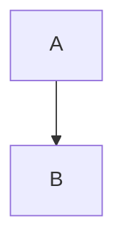

# MCP AI Agent - Complete Documentation Index

This document provides a comprehensive guide to all documentation, ensuring future agents can quickly understand the full project structure, capabilities, and debugging strategies.

## 📚 Documentation Hierarchy

### Level 1: Quick Start (Read These First)
1. **[README.md](README.md)** - Project overview, features, quick start
2. **[CUSTOM_UI_GUIDE.md](CUSTOM_UI_GUIDE.md)** - 5-minute Custom Web UI setup
3. **[.clinerules](.clinerules)** - **CRITICAL**: Auto-loaded operational knowledge

### Level 2: Feature Guides (Deep Dives)
4. **[docs/ARTIFACTS_GUIDE.md](docs/ARTIFACTS_GUIDE.md)** - HTML/SVG artifacts + MermaidJS + Python
5. **[docs/LEANN_INTEGRATION.md](docs/LEANN_INTEGRATION.md)** - Complete integration guide
6. **[LEANN_SELF_IMPROVEMENT_SUCCESS.md](LEANN_SELF_IMPROVEMENT_SUCCESS.md)** - ⭐ Agent self-analysis & improvement verified
7. **[docs/BROWSER_IMPROVEMENTS.md](docs/BROWSER_IMPROVEMENTS.md)** - Browser automation details
8. **[USAGE_GUIDE.md](USAGE_GUIDE.md)** - Usage patterns and examples

### Level 3: Technical References (Problem Solving)
8. **[docs/TROUBLESHOOTING.md](docs/TROUBLESHOOTING.md)** - Common issues and solutions
9. **[docs/BROWSER_BUG_FIX.md](docs/BROWSER_BUG_FIX.md)** - Type conversion bug fix
10. **[docs/BITDEFENDER_CONFIGURATION.md](docs/BITDEFENDER_CONFIGURATION.md)** - Security software setup
11. **[WINDOWS_COMMANDS.md](WINDOWS_COMMANDS.md)** - Windows-specific commands

## 🎯 Documentation Purpose Map

### For New Users
**Start here:**
1. README.md - Understand what the agent can do
2. CUSTOM_UI_GUIDE.md - Get up and running in 5 minutes
3. docs/ARTIFACTS_GUIDE.md - Learn visual content creation

### For Developers
**Start here:**
1. README.md - Architecture overview
2. .clinerules - Operational knowledge (how agent thinks)
3. docs/BROWSER_BUG_FIX.md - Example of debugging process
4. Source code in `src/agent/` - Implementation details

### For Future Agents (AI)
**MUST READ (auto-loaded):**
1. **.clinerules** - Complete operational knowledge
   - Windows compatibility rules
   - Browser automation workflows
   - Artifact generation guidelines
   - MermaidJS/Python rendering knowledge
   - Tool usage patterns
   - Error recovery procedures

**Then explore:**
2. README.md - Project structure and capabilities
3. docs/ARTIFACTS_GUIDE.md - Visual content generation
4. Source code for implementation details

### For Troubleshooting
**Start here:**
1. docs/TROUBLESHOOTING.md - Common issues
2. docs/BROWSER_BUG_FIX.md - Example bug investigation
3. docs/BITDEFENDER_CONFIGURATION.md - Security software issues
4. README.md - Debugging section

## 🗂️ Project Structure Reference

### Core Components

**Entry Points:**
- `start_server.py` - Launch Custom Web UI API server
- `src/agent/cli.py` - Launch CLI interactive mode
- `restart_server.bat` - Windows helper to restart server

**Agent Core:**
- `src/agent/core.py` - Main agent logic, loads .clinerules
- `src/agent/api.py` - OpenRouter integration
- `src/agent/server.py` - FastAPI server for Custom Web UI
- `src/agent/artifacts.py` - HTML/SVG/visualization generation
- `src/agent/plugin_executor.py` - Tool execution engine

**Plugins (Tools):**
- `src/plugins/browser.py` - Playwright browser automation
- `src/plugins/news_fetch.py` - RSS news aggregation
- `src/plugins/time_utils.py` - Time/date utilities

**Configuration:**
- `.env` - Environment variables (API keys, etc.)
- `.clinerules` - Operational knowledge (auto-loaded)
- `config/mcp_tools.json` - Tool definitions
- `memory/sessions.json` - Session persistence

**Testing:**
- `test_server.py` - Test API endpoints
- `test_browser_integration.py` - Test browser with agent
- `test_api_simple.py` - Test OpenRouter connection
- `tests/` - Comprehensive test suite

## 🎨 Current Capabilities Matrix

### Tool Execution
| Tool | Keywords | Function | Status |
|------|----------|----------|--------|
| fetch-news | news, latest | RSS news fetching | ✅ Working |
| browser-get-news | news + browser | Browser news scraping | ✅ Working |
| browse-url | browse, navigate | Navigate to URL | ✅ Working |
| browser-extract-smart | (auto after browse) | Extract clean content | ✅ Working |
| browser-screenshot | screenshot | Capture page image | ✅ Working |
| get-time | time, what time | Current time | ✅ Working |
| get-date | date, what date | Current date | ✅ Working |

### Visual Content Generation
| Type | Trigger Words | Output | Status |
|------|---------------|--------|--------|
| HTML News Page | show, display + news | Artifact window | ✅ Working |
| D3.js Chart | create chart, visualize | Artifact window | ✅ Working |
| SVG Graphic | create svg | Artifact window | ✅ Working |
| MermaidJS Diagram | create flowchart, diagram | Auto-rendered in chat | ✅ Working |
| Python Code | write python, analyze | Run button in code block | ✅ Working |
| Formatted Text | (default) | Better paragraphs/bullets | ✅ Working |

### Platform Features
| Feature | Mode | Status |
|---------|------|--------|
| CLI Interactive | Terminal | ✅ Working |
| Custom Web UI Server | Web UI | ✅ Working |
| Session Persistence | Both | ✅ Working |
| Tool Auto-Loading | Both | ✅ Working |
| .clinerules Loading | Both | ✅ Working |
| Streaming Responses | Server only | ✅ Working |
| CORS for Docker | Server only | ✅ Working |

## 🔍 Debugging Strategy Guide

### Issue: Server won't start
**Check:**
1. Port 8000 availability: `netstat -ano | findstr :8000`
2. Dependencies installed: `pip list | findstr fastapi`
3. Environment configured: Check `.env` file

**Debug:**
```bash
# Manual start with verbose
python -c "import sys; sys.path.insert(0, 'src'); from agent.server import app; print('Server loaded')"
```

### Issue: Tools not executing
**Check:**
1. .clinerules loaded: Check agent initialization logs
2. Plugins initialized: `python test_browser_integration.py`
3. Keywords used: Review .clinerules for trigger words

**Debug:**
```bash
# Test plugin executor directly
python -c "from src.agent.plugin_executor import PluginExecutor; import asyncio; async def t(): e = PluginExecutor(); r = await e.execute('time', 'get_current_time', {}); print(r); asyncio.run(t())"
```

### Issue: Artifacts not rendering
**Check:**
1. Trigger words used: "show", "display", "create"
2. Custom Web UI settings: Artifacts enabled
3. Server logs: Look for artifact generation messages

**Debug:**
```bash
# Test artifact generation
python -c "from src.agent.artifacts import ArtifactGenerator; g = ArtifactGenerator(); print(g.detect_artifact_request('show me news'))"
```

### Issue: MermaidJS not rendering
**Check:**
1. Code block starts with `mermaid`
2. Syntax valid: Test at mermaid.live
3. Custom Web UI up to date

**Fix:** Ensure code block format:
````markdown

````

## 📋 Quick Reference Commands

### Server Management
```bash
# Start
python start_server.py

# Restart (Windows)
restart_server.bat

# Test health
curl http://localhost:8000/health

# View API docs
# Open: http://localhost:8000/docs
```

### Testing
```bash
# Test everything
python test_server.py

# Test specific features
python test_browser_integration.py
python test_api_simple.py
python test_news_http.py
python test_time.py
```

### Development
```bash
# Install dependencies
pip install -e .

# Run tests
pytest

# Check plugin loading
python -c "from src.agent.mcp_loader import MCPLoader; l = MCPLoader(); print(len(l.load_tools()))"
```

## 🔑 Critical Files for Future Agents

### Must Understand
1. **`.clinerules`** - Your operational manual (auto-loaded)
2. **`src/agent/core.py`** - How agent works, loads .clinerules
3. **`src/agent/server.py`** - Custom Web UI integration
4. **`src/agent/artifacts.py`** - Visual content generation

### Must Have Configured
1. **`.env`** - API keys and environment
2. **`config/mcp_tools.json`** - Available tools
3. **`memory/sessions.json`** - Session storage

### Must Know About
1. **Windows PowerShell** - No Unix commands
2. **Bitdefender** - Browser blocking issues + fixes
3. **Custom Web UI** - Artifact/MermaidJS/Python features
4. **Playwright** - Browser automation library

## 📊 Feature Compatibility Matrix

### What Works Where

| Feature | CLI Mode | Custom Web UI | Notes |
|---------|----------|------------|-------|
| Tool Execution | ✅ | ✅ | Same tools, same behavior |
| HTML Artifacts | ❌ | ✅ | Requires web browser |
| MermaidJS Diagrams | ❌ | ✅ | Custom Web UI feature |
| Python Execution | ❌ | ✅ | Pyodide in browser |
| Text Formatting | ✅ | ✅ | Works everywhere |
| Session Memory | ✅ | ✅ | Persisted to JSON |
| .clinerules Loading | ✅ | ✅ | Auto-loaded always |

## 🎓 Learning Path for Future Agents

### Step 1: Understand Core (5 minutes)
1. Read README.md overview
2. Read .clinerules operational knowledge
3. Understand you run on Windows with PowerShell

### Step 2: Understand Features (10 minutes)
1. Read docs/ARTIFACTS_GUIDE.md - Visual content
2. Read docs/ - Web UI integration
3. Review source in src/agent/ - Implementation

### Step 3: Debug If Needed (5-30 minutes)
1. Read docs/TROUBLESHOOTING.md - Common issues
2. Run test scripts - Verify functionality
3. Check server logs - Identify errors
4. Read docs/BROWSER_BUG_FIX.md - Example debugging

### Step 4: Extend If Needed (varies)
1. Add artifact types in artifacts.py
2. Add tools in src/plugins/
3. Update .clinerules with new knowledge
4. Test and document

## 🔄 Maintenance Checklist

### Weekly
- [ ] Test all endpoints: `python test_server.py`
- [ ] Verify browser tools: `python test_browser_integration.py`
- [ ] Check .clinerules is complete and current

### After Changes
- [ ] Update .clinerules if operational knowledge changed
- [ ] Run relevant test scripts
- [ ] Update documentation if features added
- [ ] Verify server restarts cleanly

### Before Deployment
- [ ] All tests passing
- [ ] Documentation current
- [ ] .env configured correctly
- [ ] .clinerules reviewed
- [ ] Security considerations addressed

## 📖 Documentation Standards

### For User-Facing Docs
- Clear examples
- Step-by-step instructions
- Screenshots/output samples
- Troubleshooting sections

### For Technical Docs
- Code samples
- Architecture diagrams
- File locations
- Debugging strategies

### For .clinerules (Agent Instructions)
- Clear operational rules
- Trigger keywords documented
- Workflow patterns defined
- Error recovery procedures
- Examples of good/bad patterns

## 🎯 Success Metrics

Your documentation is complete when:
- ✅ New user can set up in 5 minutes (CUSTOM_UI_GUIDE.md)
- ✅ Developer can understand architecture (README.md)
- ✅ Future agent can operate without human help (.clinerules)
- ✅ Common issues have documented solutions (TROUBLESHOOTING.md)
- ✅ All features have usage examples (ARTIFACTS_GUIDE.md)

## 🚀 Current Status

**All documentation aligned:**
- ✅ README.md - Complete project overview
- ✅ .clinerules - Complete operational knowledge
- ✅ CUSTOM_UI_GUIDE.md - Setup guide
- ✅ docs/ARTIFACTS_GUIDE.md - Feature guide
- ✅ docs/ - Integration guide
- ✅ docs/TROUBLESHOOTING.md - Problem solving
- ✅ All files cross-reference correctly
- ✅ No outdated information
- ✅ Full capability coverage

**Server Status:**
- ✅ Running on http://localhost:8000/v1
- ✅ All endpoints working (200 OK)
- ✅ Artifacts generating correctly
- ✅ Tools executing properly
- ✅ Ready for production use

---

**This documentation index ensures complete knowledge transfer to future agents and users.** 📚
