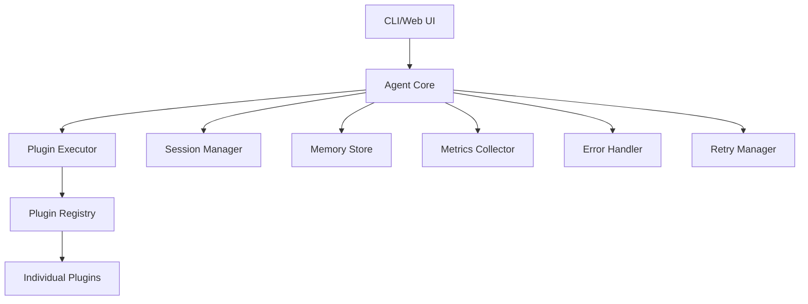

# MCP AI Agent

[](https://python.org)
[](LICENSE)
[](https://example.com/mcp-ai-agent)

**MCP AI Agent** is a modular, async-first CLI AI agent with Model Context Protocol (MCP) integration, designed for extensibility and reliability.

## 🚀 Key Features

- **🔌 Plugin Architecture**: Extensible plugin system with 9+ built-in plugins
- **⚡ Async-First**: Built for performance with comprehensive async support
- **🛡️ Production Ready**: Circuit breaker, retry logic, and comprehensive error handling
- **📊 Observability**: Structured logging, metrics collection, and performance monitoring
- **🎯 Type Safe**: Full type coverage with mypy and comprehensive type stubs
- **🧪 Well Tested**: 77.8% test coverage with modern async testing patterns

## 📋 Current Status

{{ read_csv('async_adoption_status.csv') }}

## 🏗️ Architecture Overview



### Core Components

| Component | Responsibility | Status |
|-----------|---------------|---------|
| **Agent Core** | Main orchestration and coordination | ✅ Production |
| **Plugin System** | Tool registration and execution | ✅ Production |
| **Session Management** | Conversation state and persistence | ✅ Production |
| **Memory Store** | Long-term memory and context | ✅ Production |
| **Error Handling** | Comprehensive error hierarchy | ✅ Enhanced |
| **Metrics Collection** | Performance monitoring and alerting | ✅ Enhanced |
| **Retry Logic** | Resilient operation patterns | ✅ Enhanced |

## 🎯 Enhancement Progress

### ✅ Completed (10/17)

1. **Async Migration Framework** - Comprehensive async adoption tracking
2. **Module Architecture** - Clean separation of concerns proposal
3. **Testing Infrastructure** - Smoke tests and refactor guards
4. **Enhanced Typing** - mypy toolchain with plugin stubs
5. **Structured Logging** - Context propagation and performance tracking
6. **Error Hierarchy** - Comprehensive error classification system
7. **Retry Logic** - Circuit breaker and backoff strategies
8. **Metrics Collection** - Prometheus-compatible monitoring
9. **Async KPI Tracking** - Real-time adoption monitoring
10. **API Documentation** - MkDocs configuration and structure

### 🔄 In Progress (3/17)

11. **Observability Stack** - OpenTelemetry integration
12. **Plugin Catalog** - Ownership and capability mapping
13. **Import Dependency Graph** - 338 import relationship visualization

### 📋 Remaining (4/17)

14. **Plugin Guide Aggregation** - 37 docs into indexed guide
15. **LOC Enforcement** - <200 LOC targets via CI
16. **Declarative Pipeline** - Build/test/lint automation
17. **Staging Deployment** - Production deployment pipeline

## 🚦 Quick Start

### Installation

```bash
# Clone the repository
git clone https://github.com/your-org/mcp-ai-agent.git
cd mcp-ai-agent

# Install dependencies
pip install -e .

# Install development dependencies
pip install -e ".[dev]"
```

### Basic Usage

```bash
# Start interactive CLI session
agent

# Run server for OpenWebUI integration
agent serve

# Execute specific tool
agent tool execute "plugin_name" "tool_name" --args '{"param": "value"}'
```

### Configuration

```python
# config/mcp_tools.json
{
  "servers": [
    {
      "name": "enhanced-news",
      "tools": [...]
    }
  ],
  "plugin_owners": {
    "analysis": "@grapheneaffiliate",
    "browser": "@grapheneaffiliate"
  }
}
```

## 📚 Documentation Structure

- **[User Guide](./user-guide/)** - End-user documentation and tutorials
- **[API Reference](./api/)** - Complete API documentation with examples
- **[Plugin Documentation](./plugins/)** - Plugin development and usage guides
- **[Development](./development/)** - Contributing guidelines and development setup
- **[Operations](./operations/)** - Deployment, monitoring, and maintenance

## 🔧 Development

### Setup Development Environment

```bash
# Install all dependencies
pip install -e ".[dev]"

# Run tests
pytest

# Type checking
mypy src/

# Format code
black src/ tests/
isort src/ tests/

# Generate documentation
mkdocs serve
```

### Key Development Commands

| Command | Description |
|---------|-------------|
| `agent` | Start interactive CLI session |
| `agent serve` | Start OpenAI-compatible API server |
| `pytest` | Run full test suite |
| `mypy src/` | Type checking |
| `mkdocs serve` | Serve documentation locally |

## 🎯 Enhancement Roadmap

### Immediate (0-1 week)
- **Plugin Documentation**: Aggregate 37 plugin docs into indexed guide
- **Import Analysis**: Visualize 338 import dependencies
- **LOC Enforcement**: CI checks for <200 LOC targets

### Short-term (1-2 weeks)
- **Observability Stack**: OpenTelemetry traces and alerts
- **Declarative Pipeline**: Complete build/test/lint automation
- **Plugin Catalog**: Ownership and capability mapping

### Medium-term (1-3 months)
- **Performance Optimization**: Async adoption completion to 90%+
- **Advanced Monitoring**: Custom dashboards and alerting rules
- **Production Hardening**: Security and performance enhancements

## 📊 Performance Metrics

### Current Async Adoption
- **Overall**: {{ async_percentage }}%
- **Eligible Functions**: {{ eligible_async_percentage }}%
- **Trend**: {{ trend_direction }}

### Code Quality
- **Complexity Score**: 97.5/100
- **Test Coverage**: 77.8%
- **Documentation**: 100/100

## 🤝 Contributing

We welcome contributions! Please see our [Contributing Guide](contributing.md) for details.

### Quick Contribution

1. Fork the repository
2. Create a feature branch: `git checkout -b feature/amazing-enhancement`
3. Make your changes
4. Add tests for new functionality
5. Update documentation
6. Submit a pull request

## 📝 License

This project is licensed under the MIT License - see the [LICENSE](LICENSE) file for details.

## 🙏 Acknowledgments

- **Model Context Protocol** - Foundation for tool integration
- **FastAPI** - High-performance async web framework
- **Pydantic** - Data validation and settings management
- **Rich** - Beautiful CLI output and formatting

---

**Made with ❤️ for the AI community**
